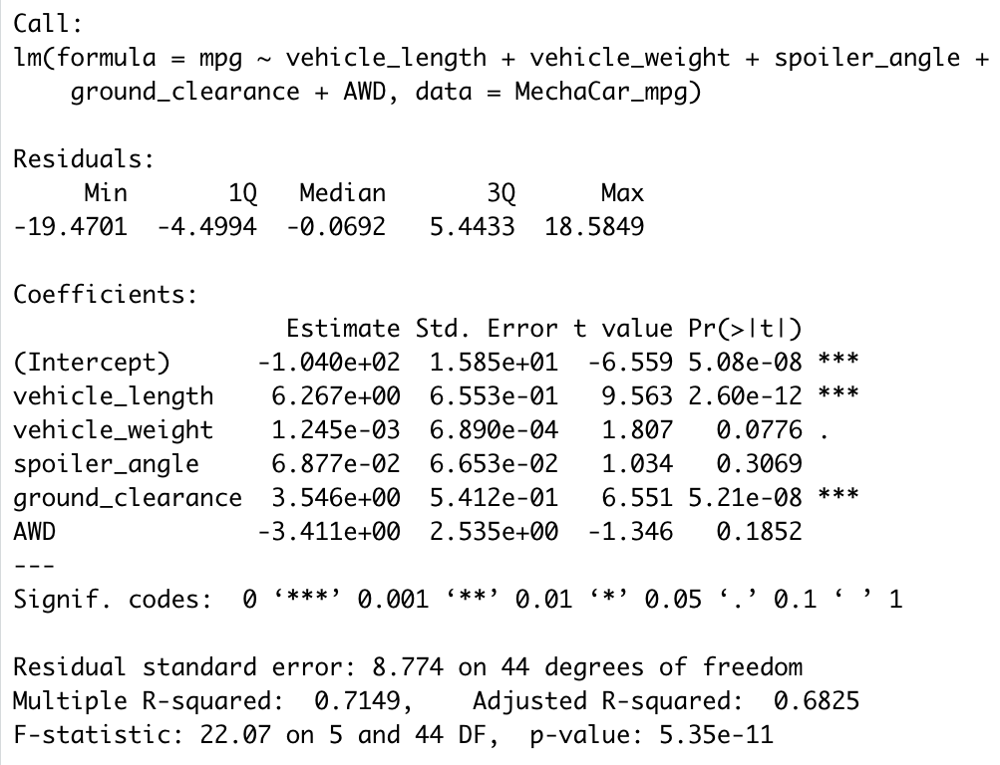
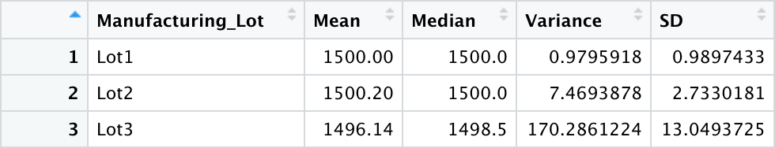
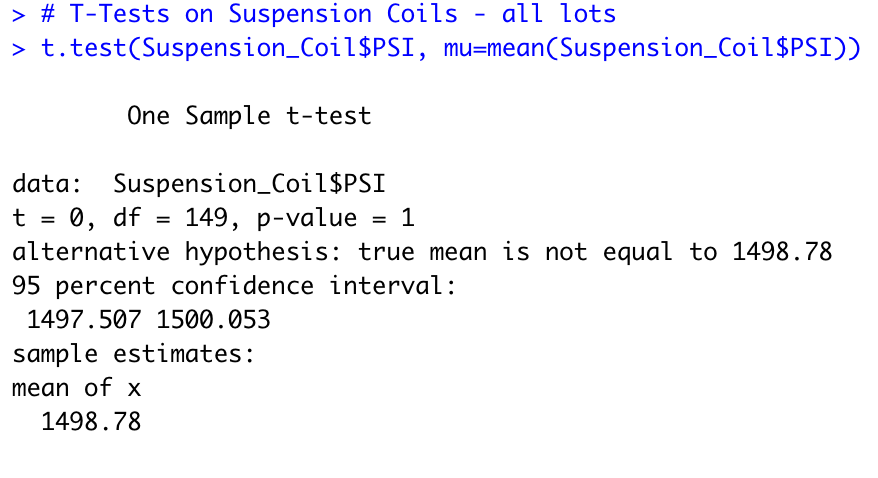
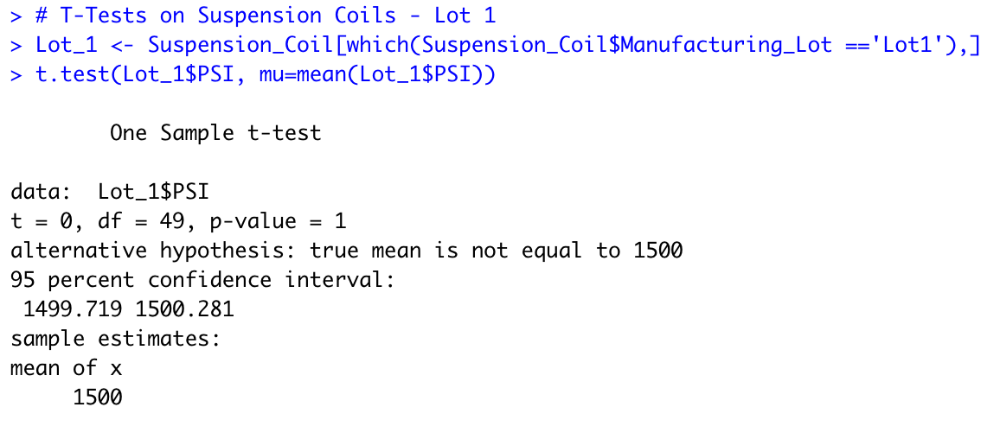
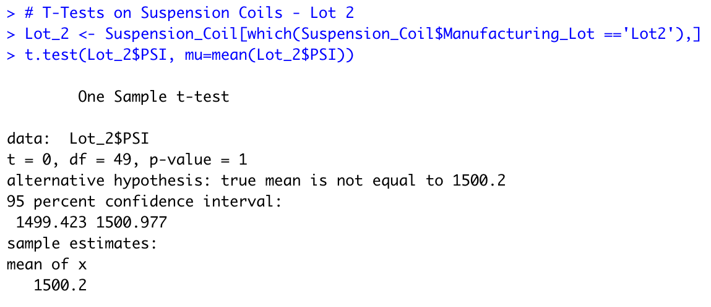
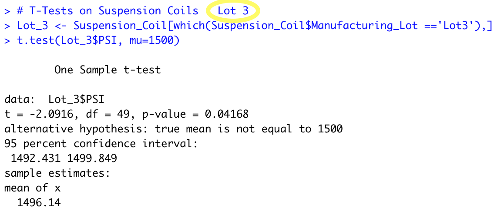

# MechaCar Statistical Analysis

Analyst: Stan Misina  &nbsp;&nbsp;&nbsp;&nbsp;<i>IDE: RStudio Version 1.4.1717   &nbsp;&nbsp;&nbsp;&nbsp;R: Version 4.1.1</i>

Data Provided:  &nbsp;&nbsp;&nbsp;&nbsp; <i>MechaCar_mpg.csv  &nbsp;&nbsp;&nbsp;&nbsp; Suspension_Coil.csv</i> 

--- 

# Overview
AutosRUS is reviewing statistical data points of the manufacturing process to find opportunities for higher consistency. Analysts have been tasked to:
  - review data points gathered from prototype vehicles to determine predictable MPG
  - provide summary statistics for suspension coil manufacturing in whole and by individual manufacturing locations
  - using T-Test models, provide insight to consistancy measures for this finished part
  - propose a study to futher compare MechaCar against competitive manufacturers
 

## Linear Regression to Predict MPG
   
- This multi-linear regression model is run on six data points of 50 prototype vehicles as provided in <code>MechaCar.csv</code>. Found are significant correlations of <b><i>vehicle length</i></b> and <b><i>ground clearance</i></b> to effect MPG. There is minor correlation to MPG with vehicle weight as well -- however, it does not fall within tolerance to be considered a consequential contributor at this time. There is a high correlation with MPG coefficient intercept to suggest there could be other data points that are not presented here.
- The slope of the linear model is not considered to be zero, as the p-value is lower than any level of importance. Therefore the null hypothesis is rejected. The the relationship between our variables and the miles per gallon is more than chance.
- Analysis suggests with the results above, and an r-squared result of better than 71%, this model will provide effective MPG predictions of MechaCar prototypes.
   

## Summary Statistics on Suspension Coils
  
<code>Suspension_Coil.csv</code>
- When looked at as a whole, variance is within the 100 psi as per company policy. This is misleading as Lot 3 is well out of range with a variance of 170+; thus the single greatest contributor to negative drag on overall performance.
 

## T-Tests on Suspension Coils 
-   **Overall** The T-test results for the suspension coils across all manufacturing plants show they are not statistically different from the population mean, and the p-value is not low enough to reject the null hypothesis. 
  
-   **Lot 1** has performed strongest of the three locations. Consistency not seen in either of the other plants and the shallowest variances. Due to this, the null hypothesis is not rejected. 
  
-   **Lot 2** shows good mean and median results; however, variances are suspect. Weighing p-value and variance, null hypothesis is not rejected, however it is recommended for the location to collaborate with Lot 1 who is performing at a higher level of consistency. 
  
-   **Lot 3** has not met company standard tolerance in manufacturing this part. Inspection of processes, personnel, machinery, and tools is recommended. This location's metrics have certainly changed company performance negatively.   
  
 

## Study Design: MechaCar vs Competition
Now that there has been a good review of MechaCar's manufacturing of suspension coils, there's opportunity to parlay this into the value of how MechaCar "rides" versus the competition. In the current environment, longevity, value, and cost are very important to the car buying population.

Points of data to capture will be degree of vehicle sway when cornering, measuring front end 'dip' when hard braking, monitoring amount of bounce when stopping suddenly, determine amount of bounce and slide on unpaved and gravel roads, and vibrations of the steering wheel.

The null hypothesis is there is no difference between MechaCar and a competitor's "ride." ANOVA test is recommended to categorically determine statistical difference between multiple samples.
