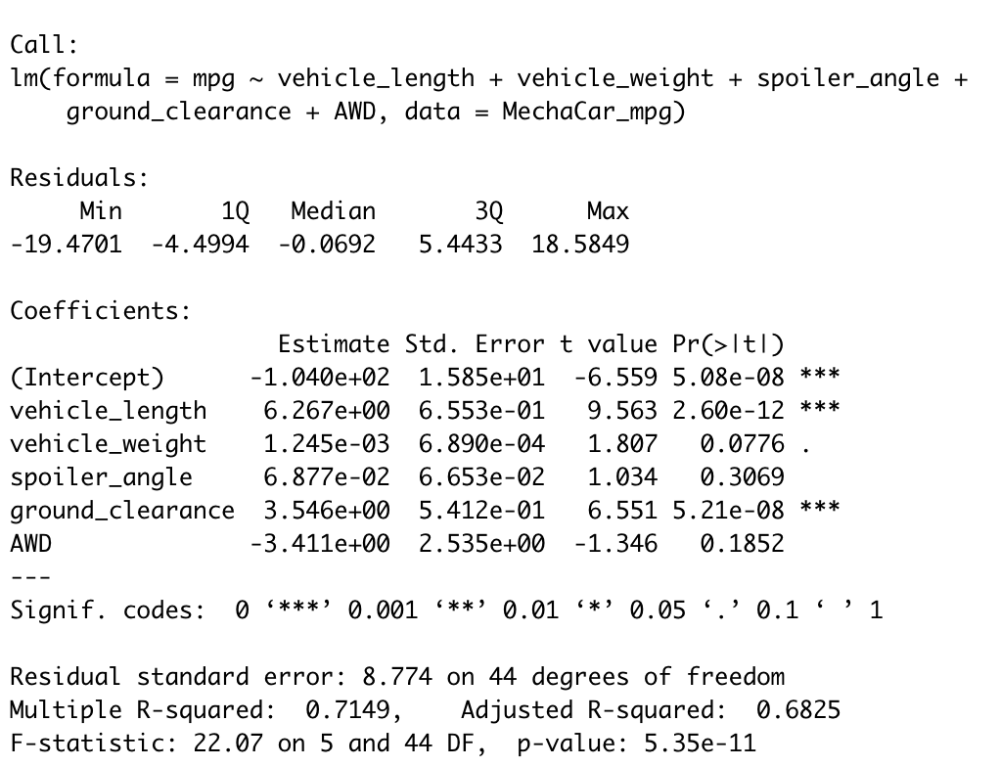

# MechaCar_Statistical_Analysis
R and Statistics

## Linear Regression to Predict MPG
  
- In this multi-linear regression model based on data representing 50 samples of 6 variables, there is significant correlation based on vehicle length and ground clearance effect on MPG to consider as key features of MPG.
