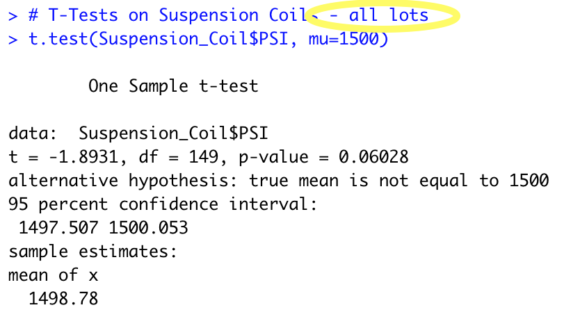

# MechaCar Statistical Analysis

Analyst: Stan Misina   <i>IDE: RStudio Version 1.4.1717   R: Version 4.1.1</i>

Data Provided:   <i>MechaCar_mpg.csv   Suspension_Coil.csv</i> 

--- 
# Overview
AutosRUS is reviewing statistical data points in the manufacturing process to find opportunities for higher consistency. Analysts have been tasked to:
  - review data points gathered from prototype vehicles to determine predictable MPG
  - provide summary statistics for suspension coil manufacturing in whole and by individual manufacturing locations
  - using T-Test models, provide insight to consistancy measures for this finished part
  - propose a study to futher compare MechaCar against competitive manufacturers

## Linear Regression to Predict MPG

   
- This multi-linear regression model is run on six data points of 50 prototype vehicles as provided in <code> MechaCar.csv</code>. Found are significant correlations of <i>vehicle length</i> and <i>ground clearance</i> to effect MPG. There is minor correlation to MPG with vehicle weight as well -- however, it does not fall within tolerance to be considered a consequential contributor at this time. There is a high correlation with the overall MPG coefficient in the intercept vector to conclude there are other data points not present.
- The slope of this model cannot be considered to be zero, due to an extremely small p-value as shown in the results. This determines that the null hypothesis should be reject.
- Analysis suggests with the results above, and an r-squared result of better than 71%, this model will provide effective MPG predictions of MechaCar prototypes.
   
  
## Summary Statistics on Suspension Coils
  
- When looked at as a whole, variance is within the 100 psi as per company policy. This is misleading as Lot 3 is well out of range with a variance of 170+. This is obviously well out of tolerance and thus the single greatest contributor to negative drag on overall performance. 

## T-Tests on Suspension Coils 
-   **Overall** manufacturing suspension coils manufacturing shows that not statistically different from the population mean. P-value is within tolerance to reject  null hypothesis. 
  
-   **Lot 1** has performed strongest of the three locations. Consistency not seen in either of the other plants and the shallowest variances. Due to this, the null hypothesis is not rejected. 
  
-   **Lot 2** shows good mean and median results; however, variances are suspect. Weighing p-value and variance, null hypothesis is not rejected, however it is recommended for the location to collaborate with Lot 1 who is performing at a higher level of consistency. 
  
-   **Lot 3** has not met company standard tolerance in manufacturing this part. Inspection of processes, personnel, machinery, and tools is recommended. This location's metrics have certainly changed company performance negatively.   
  
 

## Study Design: MechaCar vs Competition
Write a short description of a statistical study that can quantify how the MechaCar performs against the competition. In your study design, think critically about what metrics would be of interest to a consumer: for a few examples, cost, city or highway fuel efficiency, horse power, maintenance cost, or safety rating. In your description, address the following questions: - What metric or metrics are you going to test? - What is the null hypothesis or alternative hypothesis? - What statistical test would you use to test the hypothesis? And why? - What data is needed to run the statistical test?

The statistical study design has the following: A metric to be tested is mentioned (5 pt) A null hypothesis or an alternative hypothesis is described (5 pt) A statistical test is described to test the hypothesis (5 pt) The data for the statistical test is described (5 pt)
