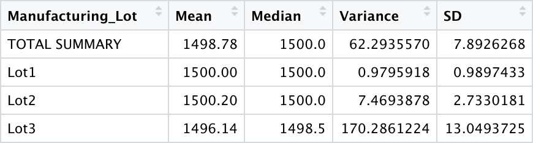
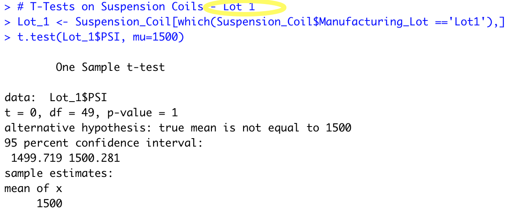
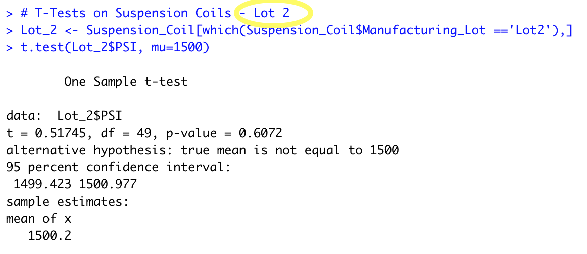

# MechaCar Statistical Analysis

Analyst: Stan Misina   <i>IDE: RStudio Version 1.4.1717   R: Version 4.1.1</i>

Data Provided:   <i>MechaCar_mpg.csv   Suspension_Coil.csv</i> 

---
## Linear Regression to Predict MPG

   

- This is a multi-linear regression model based on data representing 50 test vehicles over six data points. Found significant correlation of vehicle length and ground clearance to effect MPG. There is minor correlation to MPG with vehicle weight as well; however, it does not fall within standard tolerance to be considered a consequential contributor at this time.  

---
## Summary Statistics on Suspension Coils

  

-   Grouped total summary of the median, mean, variance, and standard deviation for suspension coil manufacture. The consistency results of the three individual lots are broken out for individual review.
-   Lot 1 has performed strongest of the three locations. Consistency not seen in either of the other plants and the shallowest variances.
-   Lot 2 shows good mean and median results; however, their variances are suspect. Considering the entire population of parts is not sufficient to ascertain performance. The individual pieces are not consistent.
-   Lot 3 has not met any of company standard toleration in manufacturing this part. Inspection of processes, personnel, machinery, and tools is recommended. This location's metrics have certainly changed the performance of the entire company negatively. 
 
------ 
 

## T-Tests on Suspension Coils 
 
 
   
-------  
   
    
------- 
   
    
-------  
   
    
-------  
   
-----  
   
## Study Design: MechaCar vs Competition

Write a short description of a statistical study that can quantify how the MechaCar performs against the competition. In your study design, think critically about what metrics would be of interest to a consumer: for a few examples, cost, city or highway fuel efficiency, horse power, maintenance cost, or safety rating. In your description, address the following questions: - What metric or metrics are you going to test? - What is the null hypothesis or alternative hypothesis? - What statistical test would you use to test the hypothesis? And why? - What data is needed to run the statistical test?

The statistical study design has the following: A metric to be tested is mentioned (5 pt) A null hypothesis or an alternative hypothesis is described (5 pt) A statistical test is described to test the hypothesis (5 pt) The data for the statistical test is described (5 pt)
